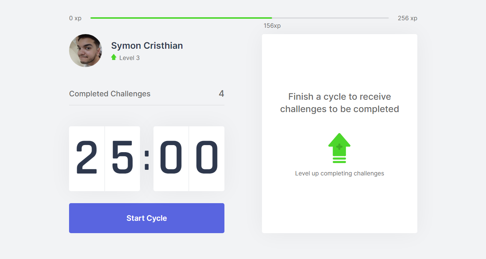

# <p align=center> Move.it</p>

<h1 align=center>
    
</h1>

## About
**Move.it** is an app based in the pomodoro technique where during the interval of cycles you can complete  challenges to earn experience and prevent damages to your body for the continuous use of a computer

[Access here]()

---

## Technologies used 
* [Node](https://nodejs.org/en/download/)  
* [React](https://reactjs.org/)
* [Next.js](https://nextjs.org/)

---
## Functionalities 

### Completing challenges

<h1 align=center>
    
</h1>

## 📂How to download the project
This project needs [Node](https://nodejs.org/en/download/) and [Yarn](https://classic.yarnpkg.com/en/docs/install/#windows-stable) installed.

```bash
    # Clone the project
    $ git clone https://github.com/s4imu/Move.it.git
    
    # Move into the directory
    $ cd Move.it  

    # Install dependencies
    $ yarn install

    # Start the Project
    $ yarn dev
```
